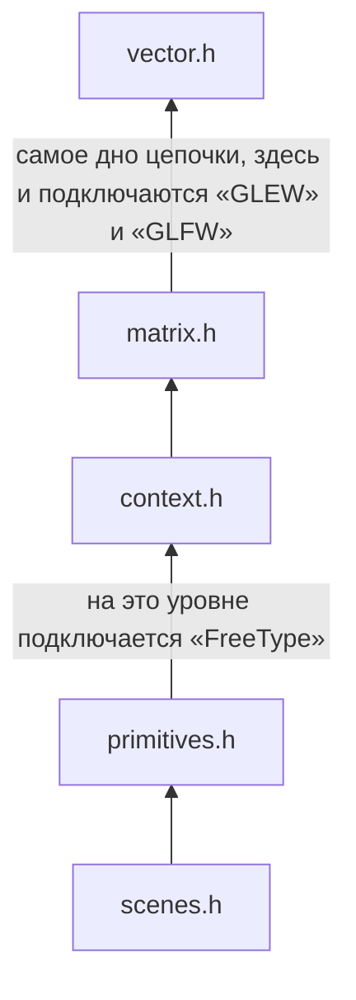

# Основные сведения

&emsp;Функциональность проекта заключается в возможности поиграть в многие известные клеточные автоматы,
в том числе игру «Жизнь» (Conway's Game) с различными правилами в 1D, 2D и 3D варианте.

&emsp;Можно задавать изначальное положение клеток, вид соседства, правила появления и выживания клеток.
Приложение запускается с помощью терминала командой «make run», после чего открывается интерфейс программы.
В интерфейсе присутствуют кнопки выбора сцены, среди которых реализации различных правил для клеточных автоматов.

&emsp;Для запуска потребуются библиотеки «FreeType», «GLEW» и «GLFW».
Из них «FreeType» уже вшит в игру, а остальные устанавливаются единожды через «make install» (для этого уже должен быть предуставновлен «gcc» и «make»).
В случае неудачи, есть альтернатива «make install2» (для этого, помимо «gcc» и «make», ещё требуется «cmake»).
Оба варианта требуют sudoers-права из-за приминения в них apt-get.

&emsp;В приложении нет C++ кода, следовательно GLM (математическая бибилотека для OpenGL) не используются.
Для этого были реализованы vector.c/.h и matrix.c/.h файлы.

# Для тех, кто хочет создавать свои сцены

&emsp;В приложении специально используется цепочка инклюдов, где каждый последующий зацепляет предыдущий:

Также есть дополнительные заголовочные файлы, не входящие в цепочку:
1. scene_*.h (каждый файл - одна сцена, только здесь из основной цепочки берётся только scenes.h).
2. shaders.h (все шейдеры здесь).
3. main.h (здесь подключаются все дополнительные заголовочники и scenes.h)

## Жизненный цикл сцены:
&emsp;Каждая сцена должна быть размещена в src/cellular/scene_&lt;name&gt;.c из-за невозможности протестировать по причинам OpenGL. 
Вся механика сцены, не связанная явно с scenes.h, должна быть размещена в src/libcellular/scene_&lt;name&gt;>.c, что будет тестироваться. 
У каждой сцены есть максимум 4 функции, при том каждая из них может отсутсвовать без вреда программе:
1. void init_scene_&lt;name&gt;(struct Scene *scene)
    - Здесь единожды производится инициалиция личного контекста сцены и первичное появление объектов,
    и то при условии, если сцена была открыта через глобальное GUI, а не заранее.
2. void render_scene_&lt;name&gt;(struct Scene *scene)
    - Каждый тик игрового цикла происходит здесь. Вся анимация частей размещается здесь.
3. void gui_scene_&lt;name&gt;(struct Scene *scene)
    - Локальное GUI (GUI сцены). Вся механика GUI элементов размещается здесь.
4. void free_scene_&lt;name&gt;(struct Scene *scene)
    - В том случае, если init_scene_&lt;name&gt; использует какие-то выделения памяти, то здесь они должны
    быть освобождены. Выделение памяти под личный контекст сцены освобождать здесь НЕ НАДО,
    т.к. только он автоматически освобождается при закрытии самого приложения, если не равен NULL.

Подключение этих сцен производится через bind_scene в main функции src/cellular/main.c файла. Каждый параметр, вполне может быть равен NULL.
Без личного контекста сцены, все эти 4 метода никак не получится связать, следовательно render/free_scene_&lt;name&gt; не будут иметь смысла.
У каждой кнопки будет своя калбак фукнция, что должна быть реализован в пределах исходного файла этой же сцены.

## Система сцен разделена на 3 уровня:
1. Модели (куб, сфера, тор, цилиндр и т.д.), что участвуют в самой отрисовке объектов. У них нет ни позиции, ни поворота...
2. Части. Хранят в себе позицию, поворот, цвет, какую модель используют и другую механику.
3. Сцены. Собственно говоря то, что хранит в себе части.

- Во время завершения приложения производится освобождения всех сцен (и их контекстов),
частей и моделей автоматическо системой сцен перед закрытием окна.

- Использовать функции других заголовочных файлов, помимом scenes.h и primitives.h (и некоторых функций в них)
крайне не рекомедуется! Вполне можно использовать векторы и матрицы. Если нужно использовать свои шейдеры, одумайтесь,
если не знаете точно, как работает система сцен.

- В каждой src/cellular/scene_&lt;name&gt;.c достаточно инклюдить только <scene.h> из-за цепочки.

- Все другие заголовочные файлы по типу math.h, string.h и т.п. рекомедуется подключать в исходниках, а не заголовочных файлах сцен.
   
